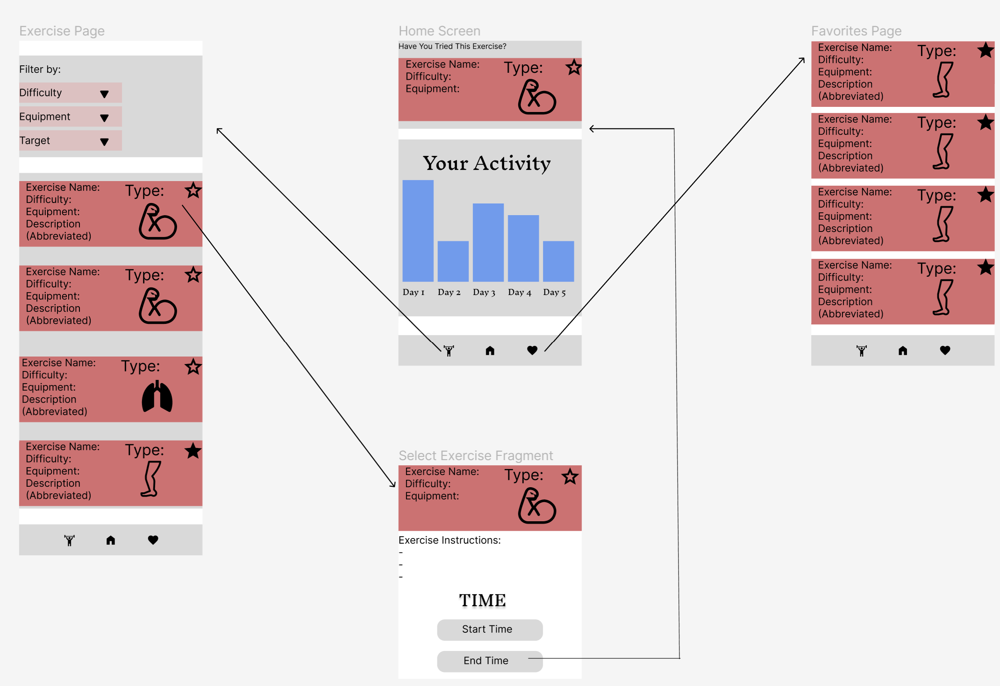

# FitApp
## Table of Contents
1) Overview
2) Specs
3) Wireframes
## Overview
### Description
 The FitApp is an application to provide users with a streamlined workout experience. Users can select their own exercises from a list, filtered to their specifications and view information such as difficulty or muscle groups involved. Users can then time their own set within the application and log it to the app.

### App Evaluation
 - Mobile: A mobile device is ideal for this application. Users will likely exercise regularly so having easy access to a device is mandatory. User activity will also be logged in a local database and referenced when calculating activity. There are other features, such as the keeping of exercise activity, that would require a device clock.
 - Story: Creates a fully personalized experience for users interested in their health. The application makes sure that no user is fully left out by providing exercises for different muscles groups and difficulty levels while also encouraging them to try new exercises based on their preferences.
 - Market: Anyone who has an interest in expanding their fitness expereince would benefit from this application.
 - Habit: Users are likely opening this app throughout the day not only to exercise, but also track how active they've been and to make adjustments to their routine.
  - Scope: V1 would give users access to the filterable list of exercises, the option to favorite these exercises as well as use the in-app timer to log their activity. They would also be shown a bar graph on the home page in order to visualize this activity. V2 would allow for more accessible options. An additional option to filter based on handicaps, such sit-down versions of exercises. V3 would provide visual guides for the exercises instead of only text descriptions.
   
## Product Specs
 
**Required Must-Have Stories:**

  [X] User can view all exercises and make a selection from them
  
  [x]User can filter results based on criteria such as difficulty
  
  [x] User can favorite an exercise to view it anytime from the favorites page
  
  [x] User can start a timer within the app to start an exercise
  
  [x]Upon ending the timer, the exercise and its duration is added to the user's activity
  
  - User is shown a bar graph representing their progress throughout the last 7 days

**Nice to Have Stories:**
  - User can view a breakdown of their activity for each day. This includes what exercise and its duration
  - User can receive recommendations based on what exercises they perform most
  - Icons are used for some text on the exercise info cards, such as what muscle the exercise targets

**Screen Archetypes**
  - Home Screen:
    - Displays user activity
    - Shows a recommended exercise
  - Exercise List:
    - Displays all exercises
    - Allows for filtered results
  - Exercise Select (fragment):
    - Shows a full description of the exercise
    - displays the timer with start and end buttons
  - Favorites Page:
    - Displays all exercises favorited by the user

**Navigation Flows**
  - Navigation Bar:
    - Exercise List
    - Home Page
    - Favorites Page
  - Exercise Screen:
    - ==> Selected Exercise fragment
  - Favorites Screen:
    - ==> Selected Exercise fragment
  - Exercise Fragment:
    - ==> Home (After hitting the end time button)
  
## Wireframes

## Prototype

**Issue Cards**

**Completed user stories**
User can view all exercises and make a selection from them

User can filter results based on criteria such as difficulty

**Pending User stories**
User can view a breakdown of their activity for each day. This includes what exercise and its duration

User can receive recommendations based on what exercises they perform most

Updated Completed User stories for milestone 3
